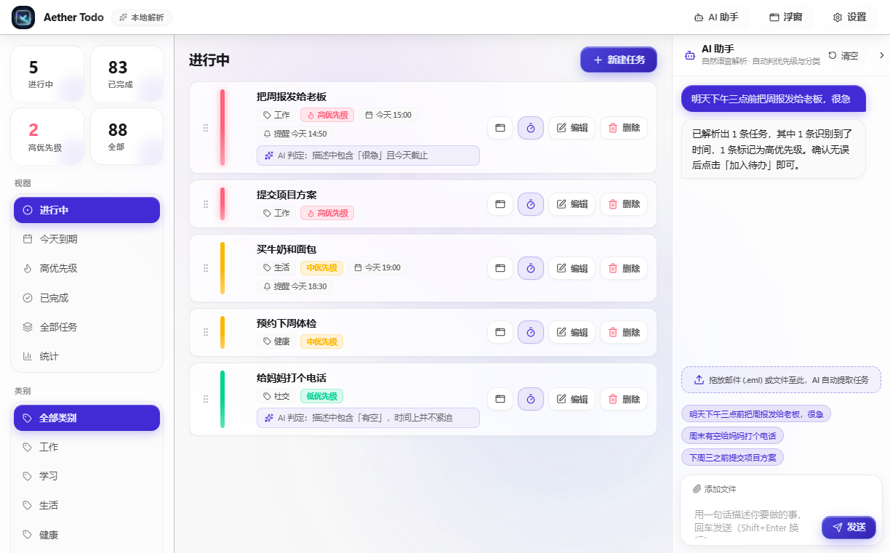
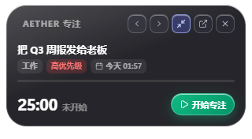
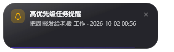
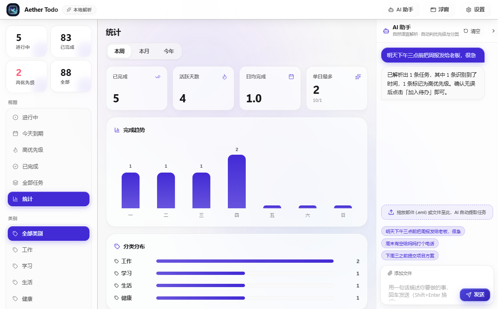
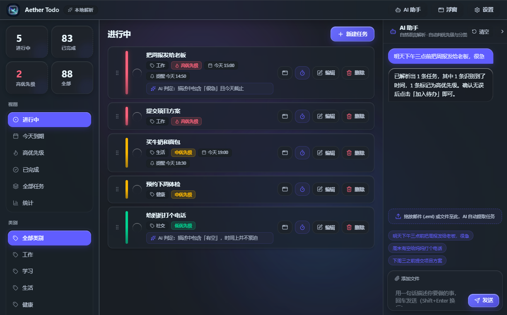

<p align="center">
  
</p>

<h1 align="center">Aether Todo · AI 待办</h1>

<p align="center">
  <b>Vibe coding 时代的个人时间控制台</b><br/>
  一个人同时管着好几个 AI Agent，别把自己弄丢了<br/>
  一句话丢进待办，自动排好优先级和时间，到点提醒你
</p>

<p align="center">
  <a href="https://github.com/RyanLin1995/Aether-Todo/releases/latest"></a>
  <a href="https://github.com/RyanLin1995/Aether-Todo/releases"></a>
  
  <a href="LICENSE"></a>
</p>

<p align="center">
  <a href="https://github.com/RyanLin1995/Aether-Todo/releases/latest">下载</a> ·
  <a href="./README.md">English</a>
</p>



## 为什么做这个

Vibe coding 之后，我发现自己变成了「多线程」。

- 左边 Claude Code 在跑任务，右边 Codex 在改另一个仓库，脑子里还压着「晚点回老板消息」「记得买牛奶」。
- 注意力被切得很碎。一天下来 Agent 干了一堆活，我自己却什么都没记住。
- 真正缺的不是更多 Agent，而是一个能**重新安排自己的时间、并且会把你叫回来**的东西。

于是有了 Aether Todo —— 一个跑在 Windows 上的本地优先待办 + 专注工具。

把脑子里那些零碎的「等下要做」一句话丢进来，它帮你排好优先级、盯着进度、到点提醒。不注册、不联网、不上传，数据全在你本机。

## 它长什么样

<table>
<tr>
<td width="50%"></td>
<td width="50%"></td>
</tr>
<tr>
<td></td>
<td></td>
</tr>
</table>

## 一句话 → 一条任务

说 / 打字一句 **「明天下午三点前把周报发给老板，很急」**：

```
截止时间   明天 15:00
优先级     高    （理由：说了「很急」，且今天截止）
类别       工作
```

点「加入待办」→ 到点自动提醒。想反悔也行：说「周报我已经写完了」，它会自己找到那条任务标成完成。

## 主要功能

- **自然语言建任务** —— 说人话就行，一句话能拆成好几条
- **自动判优先级 + 分类** —— 高/中/低，每条附一句人话理由
- **到点提醒** —— 支持「提前提醒」，托盘后台常驻，关窗照样响
- **番茄钟（可暂停）** —— 专注时长自定，支持暂停 / 恢复
- **重复任务** —— 按天 / 周 / 月 / 年重复，可指定周几与间隔（如每 2 周）；完成当期自动生成下一期，每期保留独立的完成状态与备注；编辑 / 删除可选「仅本次」还是「整个系列」
- **灵动岛悬浮窗** —— 贴边吸附，随时瞄一眼当前任务和倒计时
- **统计大屏** —— 本周 / 本月 / 今年的完成量、趋势、分类分布
- **液态玻璃界面** —— 深浅色可选，整体透明度实时拖动
- **中英双语** —— 界面、AI 回复、提醒文案全都跟着切
- **纯本地** —— 单个人类可读的 JSON 文件，原子写入，零遥测
- **有 Key 没 Key 都能用** —— 任意 OpenAI 兼容大模型（DeepSeek、通义、智谱、Ollama…）；没配 Key 或网络出错，自动降级到内置本地规则引擎，永不下线

## 下载

Windows x64，双击安装，安装向导支持**中英文选择**。

**[下载最新版本](https://github.com/RyanLin1995/Aether-Todo/releases/latest)**

> 安装包未做商业代码签名，首次运行 Windows SmartScreen 可能提示，点「更多信息 → 仍要运行」即可。

## 自己跑一遍

```bash
bun install                                        # 装依赖
ELECTRON_MIRROR=https://npmmirror.com/mirrors/electron/ \
  node node_modules/electron/install.js            # 补 Electron 二进制（Bun 不跑 postinstall）
bun run start                                      # 构建 + 启动
```

| 命令 | 干嘛的 |
|---|---|
| `bun run start` | 构建并启动 |
| `bun run typecheck` | TypeScript 严格类型检查 |
| `bun run test` | 逻辑与边界测试 |
| `bun run build` | 打包成 `dist/*-Setup.exe` |

## 技术栈

Electron 44 · TypeScript（strict）· Bun · 纯本地 JSON 存储 · 零原生依赖。

<details>
<summary>AI 配置 / 项目结构 / 模型输出契约</summary>

**AI 配置**：设置 → AI 大模型，填接口地址、API Key、模型名，可选网络代理（直连 / 跟随系统 / 自定义 HTTP）。Key 留空即长期使用本地规则引擎。

**项目结构**

```
src/
  shared/types.ts      主进程 / 渲染进程共享类型
  main/                Electron 主进程：窗口、托盘、通知、存储、AI、提醒调度
  preload.ts           contextBridge 安全 API
  renderer/            界面：任务、助手、设置、统计、番茄钟
build/                 图标源与打包资源
scripts/               构建、图标生成、诊断脚本
tests/                 逻辑测试 + CDP 驱动的 GUI 测试
docs/screenshots/      README 配图
```

**模型输出契约（严格 JSON，非 JSON 也能优雅兜底）**

```json
{
  "reply": "收到，周报已标为高优先级。",
  "intent": "create",
  "tasks": [
    {
      "title": "把周报发给老板",
      "category": "工作",
      "priority": "high",
      "priorityReason": "老板在等且今天截止",
      "dueAt": "2026-09-30T15:00:00+08:00",
      "remindAt": "2026-09-30T14:50:00+08:00"
    }
  ],
  "matchTitles": []
}
```

`intent`：`create`（新增）· `complete`（完成）· `list`（查询）· `chat`（追问）。
</details>

## 许可证

[Apache-2.0](LICENSE) © 2026 ai_todo contributors

## 致谢

本应用由 AI 助手 **WorkBuddy** 端到端完成：架构选型、双引擎 AI、界面、CDP GUI 测试、图标生成与安装包打包流水线。底层站在 Electron、Bun、electron-builder 与 Node.js 生态的肩膀上。
